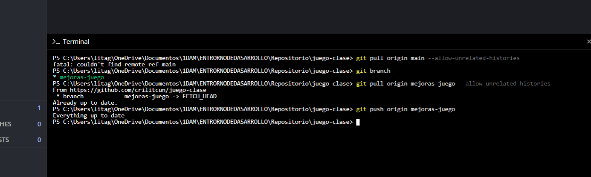
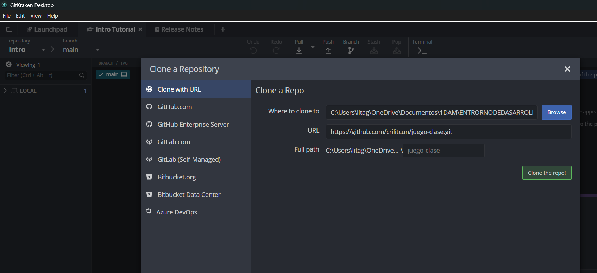
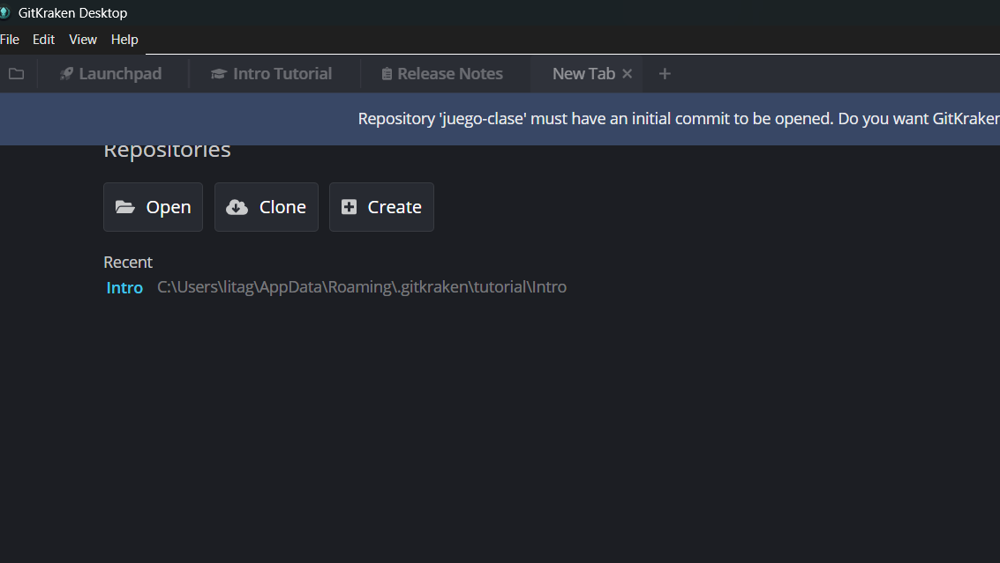
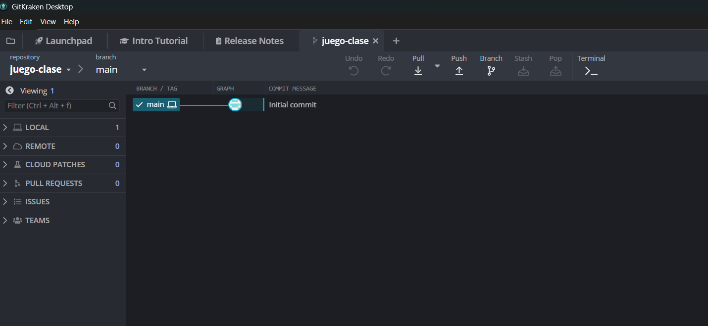
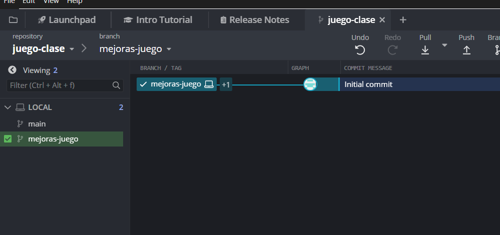
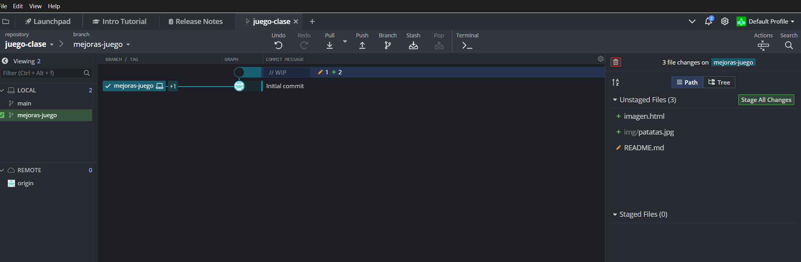
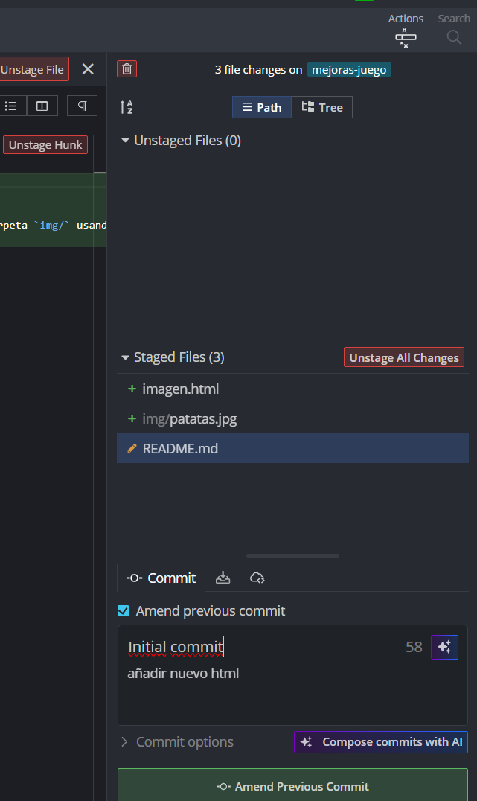
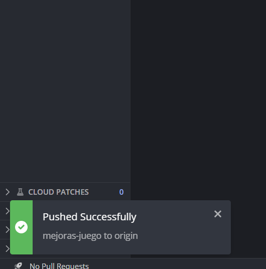

# juego-clase

en el caso de utilizar la consola de gitKraken 
git remote set-url origin https://github.com/tuusuario/tu-repo.git
git add .
git commit -m "Mis cambios"
git push origin main

he tenido que forzar el push

Resumen de comandos clave (si usas terminal dentro de GitKraken)
git remote set-url origin https://github.com/tuusuario/tu-repo.git
git add .
git commit -m "Mis cambios"
git push origin main

He incluido un archivo `imagenes.html` en la raíz del proyecto que sirve como interfaz visual. Dentro de este HTML se muestra una imagen ubicada en la carpeta `img/` usando la etiqueta ``.

 Paso a paso detallado
1.Crear un repositorio vacío en GitHub
•	Accede a GitHub y entra con tu cuenta.
•	Haz clic en el botón "New" (nuevo repositorio).
•	Nombre (juego-clase).
•	Haz clic en "Create repository".

 
2. Clonar el repositorio original en tu PC
•	Abre GitKraken.
•	En el menú lateral, selecciona "Clone a repo".
•	Introduce la URL del repositorio original  https://github.com/crilitcun/juego-clase.git.
•	Elige una carpeta local donde se guardará el proyecto.
•	Haz clic en "Clone the repo".

 

 
4. Crear una nueva rama de desarrollo
•	En GitKraken, haz clic derecho sobre la rama principal (main o master).
•	Selecciona "Create branch here".
•	Nombra la nueva rama como mejoras-juego o similar.
•	Asegúrate de estar en esa rama antes de hacer cambios.
 

 
5. Proyecto
He creado un proyecto en html, consístete en un fichero imagen.html con una carpeta img que contiene una imagen patatas.jpg 
6. Commit y Push
•	Vuelve a GitKraken.
•	Verás los archivos modificados en la sección de cambios.
•	Añade un mensaje descriptivo en el campo de commit (ej. Mejoras del juego).
•	Haz clic en "Commit changes".
•	Luego pulsa "Push" para subir los cambios a tu rama en GitHub.

